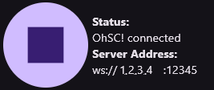
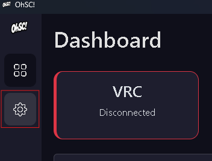
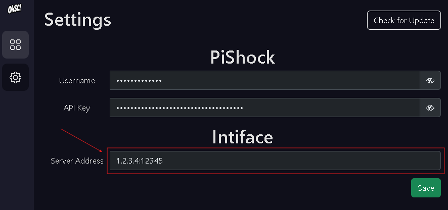
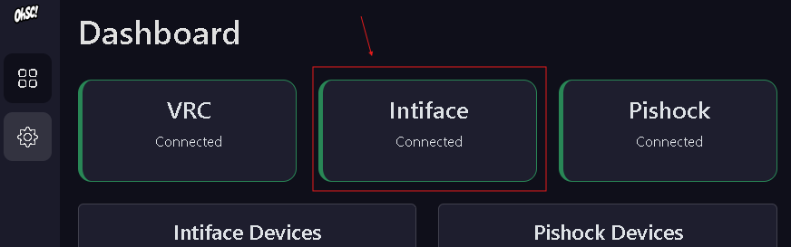

# Intiface on Mobile (Optional)

### Configure Intiface on Mobile

> The PC version is recommended over the mobile version, but it requires your PC to have Bluetooth.

> For the best experience, it's recommended to use a Bluetooth dongle instead of your PC's built-in Bluetooth or the Lovense dongle, as those tend to have a shorter range or may cause lag.

> If you are using the mobile version make sure to be connected to the same network as your PC

1. On your mobile install and launch the Intiface central App and then press the `Play` button to start the server.

2. Locate the `Server Address` and go on the OhSC! App on your PC.

    

3. Locate the `Settings` icon in the OhSC App.

    

4. Type the `Server Address` in the input `Server Address` under `Intiface` and then press `Save`.

    

5. At this point, Intiface should automatically be connected.

    

6. Continue to [Step 3](/docs/getting-started.md)

